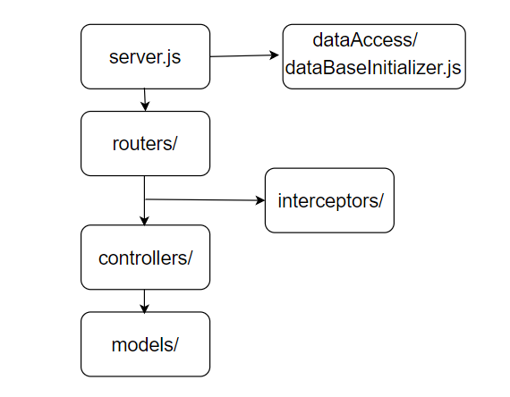

# TP FullStack

- **Alumno:** Santiago Bozzo - 0101329
- **Cursada:** 2do cuatrimestre 2019
- **Materias:** Técnicas avanzadas de programación y Arquitectura web

## Índice

- [Arquitectura](https://github.com/santibozzo/TPFullstack#arquitectura)
- [Dependencias](https://github.com/santibozzo/TPFullstack#dependencias)
- [Requisitos](https://github.com/santibozzo/TPFullstack#requisitos)
- [Ambiente local](https://github.com/santibozzo/TPFullstack#ambiente-local)
- [Tests Unitarios](https://github.com/santibozzo/TPFullstack#tests-unitarios)
- [Servidor](https://github.com/santibozzo/TPFullstack#servidor)
- [Estructura backend](https://github.com/santibozzo/TPFullstack#estructura-backend)
- [API](https://github.com/santibozzo/TPFullstack#api)

## Arquitectura

- **Backend:** nodejs (v12.7.0*)
- **Base de datos:** MongoDB (v4.2.0 Community)
- **Manejador de dependencias:** npm (v6.10.0*)
- **Servidor:** AWS EC2 (Amazon Linux)

*Versiones usadas en desarrollo, puede llegar a funcionar con otras.

## Dependencias

- [express (v4.17.1)](https://www.npmjs.com/package/express): Construir y levantar una API REST
- [mongoose (v5.7.0)](https://www.npmjs.com/package/mongoose): ODM para MongoDB
- [jsonwebtoken (v8.5.1)](https://www.npmjs.com/package/jsonwebtoken): Generacion y manipulación de JWT
- [moment (v2.24.0)](https://www.npmjs.com/package/moment): Manipulación de fechas
- [async (v3.1.0)](https://www.npmjs.com/package/async): Utilidades para funciones/tareas asincronicas
- [mocha (v6.2.0)](https://www.npmjs.com/package/mocha): Realizar tests unitarios
- [supertest (v4.0.2)](https://www.npmjs.com/package/supertest): Levantar app (express) para testear API REST 

## Requisitos

### nodejs y npm
Descargarse e instalar nodejs, la versión 12.7.0 ya viene con npm v6.10.0 incluido.

- [nodejs v12.7.0](https://nodejs.org/download/release/v12.7.0/)

### MongoDB

Descargarse e instalar MongoDB Community Server v4.2.0.

- [MongoDB Community Server](https://www.mongodb.com/download-center/community) 
(elegir la versión 4.2.0)

(OPCIONAL) Para poder visualizar la base con una GUI se puede descargar 
[MongoDB Compass](https://www.mongodb.com/download-center/compass).

## Ambiente local

- Instalar las dependencias (estando parado en backend/):
```
$ npm ci
```

- De ser necesario se pueden cambiar las variables de entorno en 
src/resources/config.json:
```
{
    "server": {
        "port": "3001"
    },
    "dataBase": {
        "host": "localhost",
        "port": "27017",
        "name": "tpFullstack"
    },
    "tokenSecretKey": "secretKey",
    "DBInitializer": {
        "initUsersAmmount": 5000
    }
}
```

- Antes de levantar el proyecto asegurarse de tener corriendo el MongoDB Community 
Server en el mismo host:port que el configurado en el config.json.

- Levantar el proyecto/backend (estando parado en backend/):
```
$ node server.js
```

## Tests Unitarios

Los tests unitarios estan hechos con mocha y supertest. Al correrlos se crea una 
nueva base que se popula con datos y una vez finalizados se elimina. 
Para correr los tests usar:
```
$ npm test
```

## Servidor

La aplicación se encuentra hosteada en una instancia EC2 (Amazon Web Service) con 
Amazon Linux. Se pueden hacer requests a http://ip.publica.de.instancia:3001/api.
A continuación se muestra como levantar el proyecto en una instancia EC2:

### Configuración

- Crear instancia de EC2 con Amazon Linux
- Configurar puertos 80 y 3001 para http requests
- Poder conectarse por SSH (configurar puerto 22)

### Instalar MongoDB

- Actualizar paquetes de yum:
```
$ sudo yum -y update
```

- Crear archivo /etc/yum.repos.d/mongodb-org-4.0.repo con el siguiente contenido:
```
[mongodb-org-4.0]
name=MongoDB Repository
baseurl=https://repo.mongodb.org/yum/amazon/2013.03/mongodb-org/4.0/x86_64/
gpgcheck=1
enabled=1
gpgkey=https://www.mongodb.org/static/pgp/server-4.0.asc
```

- Instalar:
```
$ sudo yum -y install mongodb-org
```

- Para levantarlo correr:
```
$ sudo service mongod start
```

### Instalar proyecto

- Instalar nvm (node version manager) para instalar nodejs:
```
$ curl -o- https://raw.githubusercontent.com/creationix/nvm/v0.33.2/install.sh | bash
```

- Instalar node 12.7 (reiniciar terminal primero):
```
$ nvm install 12.7
```

- Instalar git:
```
$ sudo yum install -y git
```

- Clonar proyecto:
```
$ git clone https://github.com/santibozzo/TPFullstack.git
```

- Ir a backend/ e instalar dependencias de npm:
```
$ npm ci
```

### Levantar aplicación

Para que la aplicación quede corriendo mientras la instancia esta activa vamos a 
correrla con [pm2 (node process manager)](http://pm2.keymetrics.io/), y vamos a 
configurarlo para que levante la aplicación cada vez que la instancia se inicie.

- Instalar pm2:
```
$ npm install -g pm2
```

- Estando parado en backend/ levantamos la app con pm2:
```
$ pm2 server.js
```

- Luego para configurar que esto siempre se haga al iniciar la instancia, corremos los 
siguientes comandos y corremos el comando que se imprime en pantalla al correr startup:
```
$ pm2 save
$ pm2 startup
```

## Estructura backend



### src/

- controllers/  
  - loginController.js
  - requestLimitsController.js
  - usersController.js
- dataAccess/
  - dataBaseInitializer.js
- interceptors/
  - authInterceptor.js
- models/
  - requestLimitsModel.js
  - usersModel.js
- resources/
  - config.json
  - flowDiagram.png
  - tpFullStackAPI-vX.X.X.json
- routers/
  - loginRouter.js
  - requestLimitsRouter.js
  - usersRouter.js
- test/
  - loginTest.js
  - requestLimitsTest.js
  - testSetup.js
  - usersTest.js


### server.js

Se encarga de:
- levantar la API y escuchar futuros requests
- Apuntar los distintos endpoints a sus respectivos routers
- Conectarse a la base de datos

### dataAccess/dataBaseInitializer.js

Se encarga de popular la base con datos en caso de que se encuentre vacía.

### routers/

Cada router está asignado a un endpoint y dependiendo el request que recibe llama al 
método correspondiente de su controller para luego devolver la respuesta. En caso de 
ser necesario, también le asigna a la request un interceptor.

### interceptors/ 

Se ejecutan antes de la logica que se encuntra en los controllers. Pueden devolver una 
respuesta cortando el flujo del request, o dejar que continúe con la lógica del controller.

### controllers/

Reciben el request y realizan la lógica del negocio, luego generan una respuesta y la 
devuelven. En caso de ser necesario, piden datos a la base usando los models.

### models/

Cada model representa una colección de la base de datos y se encarga de todas las 
acciones CRUD.

### resources/

Se encuentran archivos de configuración y documentación.

### test/

Se encuentran las pruebas unitarias de la API, hay dos tipos de archivos:
- **testSetup.js:** Tiene las configuraciones que se corren antes, durante, y despues 
de las pruebas.
- **endpointTest.js:** Hay uno por cada endpoint/lógica y contiene todas las pruebas 
unitarias relacionadas.

## API

### Talend API Tester

Es un cliente que te deja documentar y probar APIs REST (como postman). En caso de 
usarlo se puede importar la API entera del proyecto lista para probar con el archivo 
que se encuentra en [src/resources/tpFullStackAPI-v0.1.0.json](https://github.com/santibozzo/TPFullstack/blob/master/backend/src/resources/tpFullStackAPI-v0.1.0.json).

- [extensión chrome](https://chrome.google.com/webstore/detail/talend-api-tester-free-ed/aejoelaoggembcahagimdiliamlcdmfm)

### General

- La base de todos los endpoints es **/api**.
- Para los endpoints donde se pasa datos por body es necesario agregar el header 
"Content-Type:application/json".
- A los endpoints que son autenticados es necesario pasarles por el header 
"authorization" el token de sesión que se consigue con **/login**.
- Cada sesión dura 1h y dependiendo el usuario se tiene un limite de requests.
- Los ejemplos de la siguiente documentación usan datos que se crean por defecto 
al inicializar la base por primera vez.


### POST:login

Si el usuario y contraseña son correctos devuelve un token de sesión.
- **Autenticado:** NO
- **PathParams:**
- **QueryParams:**
- **Request body:**
```
{
    "dni": 50000000,
    "password": "123456"
}
```
- **Response body:**
```
{
    "token": "sessionToken"
}
```

### POST:users

Crea un nuevo usuario.
- **Autenticado:** NO
- **PathParams:**
- **QueryParams:**
- **Request body:**
```
{
    "dni": 40000000,
    "email": "123@prueba.gmail",
    "password": "123456",
    "creditScore": 3
}
```
- **Response body:**
```
User 40000000 created
```

### GET:users/{dni}

Devuelve la información de un usuario.
- **Autenticado:** SI
- **PathParams:**
    - dni
- **QueryParams:**
- **Request body:**
- **Response body:**
```
{
    "dni": 50000000,
    "email": "50000000@tpfullstack.com",
    "creditScore": 1
}
```

### POST:users/get

Recibe una lista de dni/cuit y devuelve una lista de los usuarios relacionados a 
esos dni/cuit. Si algún dni/cuit no se encuentra en la base se lo saltea.
- **Autenticado:** SI
- **PathParams:**
- **QueryParams:**
- **Request body:**
```
[
    {"dni":500000000},
    {"cuit":"23-50000001-9"}
]
```
- **Response body:**
```
[
    {
        "dni": 50000000,
        "creditScore": 1
    },
    {
        "dni": 50000001,
        "creditScore": 4
    }
]
```

### GET:request-limits/{dni}

Devuelve la información relacionada al limite de requests por hora que tiene el 
usuario. Sólo se puede obtener la información del usuario de la sesión.
- **Autenticado:** SI
- **PathParams:**
    - dni
- **QueryParams:**
- **Request body:**
- **Response body:**
```
{
    "limit": 10,
    "uses": 2,
    "lastRefresh": "21/09-20:35",
    "dni": 50000000
}
```

### PATCH:request-limits/{dni}

Cambia el limite de requests por hora del usuario por el limite dado. Sólo se puede 
cambiar el limite del usuario de la sesión.
- **Autenticado:** SI
- **PathParams:**
    - dni
- **QueryParams:**
- **Request body:**
```
{
    "limit": 20
}
```
- **Response body:**
```
OK
```